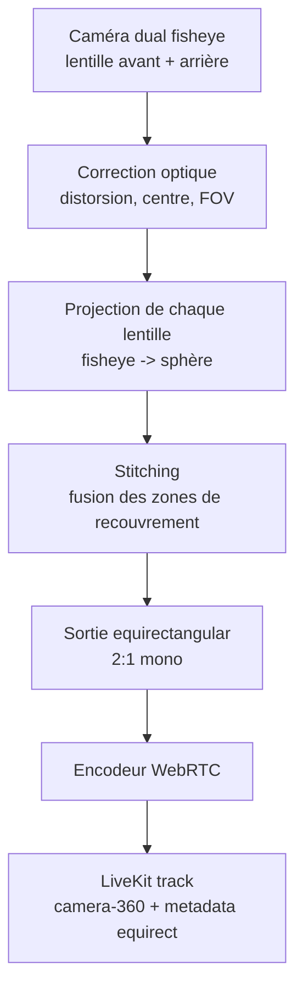
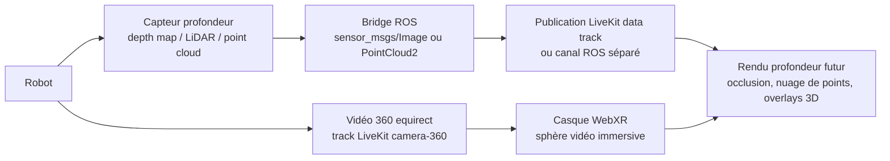

# Pipeline immersion 360 OSCAR via LiveKit

Cette page décrit le pipeline cible pour afficher dans le casque une vue réellement immersive de l'environnement envoyé par le robot. L'objectif est d'éviter le rendu actuel en "écran cinéma incurvé" lorsque le flux devrait être une vue 360.

## Pourquoi l'écran incurvé apparaît aujourd'hui

Le front OSCAR choisit entre deux modes :

- `flat` : le flux vidéo est projeté sur un écran cinéma incurvé devant l'utilisateur.
- `equirect` : le flux vidéo est projeté sur l'intérieur d'une sphère, avec l'utilisateur au centre.

Aujourd'hui, le mode `equirect` n'est choisi que si le flux LiveKit permet de le déduire :

- metadata participant : `{ "projection": "equirect" }`
- nom de track contenant `360`, `equirect` ou `pano`
- ratio vidéo proche de `2:1`

Si aucune de ces informations n'est disponible, le front retombe en `flat`, donc en écran incurvé. Le problème n'est pas seulement côté casque : il faut que le robot publie un flux déjà préparé et clairement annoncé comme 360.

Pour les tests sans robot ni caméra 360, OSCAR peut forcer le rendu sphérique avec `?force360=1` dans l'URL, ou avec `VITE_FORCE_IMMERSIVE_360=true`. Cela valide le comportement côté casque, mais ne transforme pas une vidéo plate en vraie vidéo 360.

Pour un test plus strict, OSCAR peut aussi refuser l'entrée VR si le flux n'est pas déclaré immersif avec `?require360=1` ou `VITE_REQUIRE_IMMERSIVE_360=true`. Ce mode évite de confondre un écran plat avec une vraie immersion.

## Principe d'une vraie vue immersive

Une vue 360 immersive n'est pas une vidéo normale agrandie. Le casque doit recevoir une image représentant toute la sphère autour du robot, puis la mapper autour de l'utilisateur.

Le format recommandé pour OSCAR v1 est **equirectangular mono 2:1** :

- largeur = 2 x hauteur, par exemple `3840x1920`
- axe horizontal = longitude `0° → 360°`
- axe vertical = latitude `-90° → +90°`
- utilisateur placé au centre d'une sphère virtuelle

```mermaid
flowchart LR
  A["Robot<br/>capteur 360 ou dual fisheye"] --> B["Calibration<br/>intrinsèques + extrinsèques"]
  B --> C["Stitching / dewarp<br/>format equirectangular 2:1"]
  C --> D["Encodeur WebRTC<br/>H.264/VP8/VP9 basse latence"]
  D --> E["Participant LiveKit robot<br/>track vidéo camera-360"]
  E --> F["Serveur LiveKit SFU<br/>routage WebRTC temps réel"]
  F --> G["Casque OSCAR<br/>abonnement à la track vidéo"]
  G --> H["WebXR + Three.js<br/>VideoTexture sur sphère intérieure"]
```



## Pipeline caméra 360 equirectangular

Cas idéal : la caméra robot produit déjà une sortie equirectangular, ou son SDK fournit directement une image 360 prête à encoder.

Pipeline recommandé :

1. Le robot récupère le flux caméra natif.
2. Le flux est normalisé en equirectangular mono 2:1.
3. Le robot encode en WebRTC basse latence.
4. Le robot publie la track dans LiveKit avec le nom `camera-360`.
5. Le participant LiveKit robot annonce la metadata `projection: "equirect"`.
6. Le casque reçoit la track et construit une sphère intérieure.

Ce mode doit être la référence v1, car il simplifie le front : le casque n'a pas à deviner la géométrie du capteur.

## Pipeline caméra dual fisheye

Une caméra dual fisheye fournit généralement deux images circulaires, une par lentille. Ce format n'est pas directement immersif pour le casque : il doit être assemblé côté robot ou côté pipeline vidéo avant LiveKit.



Points importants :

- Le dual fisheye brut ne doit pas être envoyé au casque comme format final.
- La calibration est indispensable : FOV, centre optique, orientation des lentilles, zone de recouvrement.
- Le stitching doit être fait avant LiveKit pour éviter de déplacer une charge GPU/CPU instable vers le casque.
- FFmpeg peut servir de référence ou d'outil de prototype avec le filtre `v360`, mais la production peut utiliser un pipeline GStreamer, OpenCV, SDK caméra ou GPU shader selon le robot.

## Transmission LiveKit

LiveKit est utilisé comme transport temps réel. Dans OSCAR, il joue le rôle de salle WebRTC :

- le robot rejoint la room comme participant publisher
- le casque rejoint la room comme participant subscriber
- le serveur LiveKit agit comme SFU et route les tracks vidéo/audio/data

Contrat minimal recommandé :

```json
{
  "projection": "equirect",
  "layout": "mono",
  "stereo": "none",
  "depth": "none"
}
```

Règles de publication :

- participant robot : identité stable, par exemple `robot-oscar-1`
- track vidéo : `camera-360`
- metadata participant : JSON ci-dessus
- format vidéo : equirectangular 2:1
- mode v1 : mono 360, pas de profondeur obligatoire

Le nom `camera-360` peut rester un fallback, mais la metadata doit être prioritaire. Le ratio 2:1 est utile comme dernier recours, pas comme source de vérité principale.

## Rendu côté casque WebXR

Côté casque, le flux LiveKit est attaché à un élément `<video>`, puis transformé en texture Three.js avec `VideoTexture`.

Pour une vraie immersion :

1. Démarrer une session `immersive-vr`.
2. Créer une sphère autour de l'utilisateur.
3. Inverser la géométrie pour voir la texture depuis l'intérieur.
4. Appliquer la texture vidéo sur cette sphère.
5. Laisser WebXR gérer la pose de la tête et les vues gauche/droite du casque.

Le rendu `flat` sur écran cinéma doit rester disponible uniquement pour les flux non 360 ou pour un mode debug. En mode "immersion 360 obligatoire", le front doit refuser ou signaler un flux qui n'est pas equirectangular.

## Gestion de la profondeur

Une vidéo 360 mono ne contient pas une vraie profondeur exploitable. Elle donne une direction visuelle autour du robot, mais pas la distance fiable des objets.

Pour ajouter la profondeur, il faut une source supplémentaire :

- caméra RGB-D
- stereo depth
- LiDAR
- point cloud ROS
- depth map calculée côté robot



Recommandation v1 :

- afficher d'abord la vidéo 360 mono correctement
- garder la profondeur hors du chemin critique
- préparer un contrat séparé pour depth map / point cloud

Recommandation v2 :

- publier une depth map synchronisée à la vidéo, si disponible
- ou transmettre un point cloud décimé côté ROS
- corréler vidéo et profondeur via timestamp
- limiter le débit de profondeur pour préserver la latence vidéo

## Contrat metadata LiveKit

Le front doit interpréter la projection dans cet ordre :

1. override de test explicite `?force360=1` ou `VITE_FORCE_IMMERSIVE_360=true`
2. `metadata.projection`
3. nom de track (`camera-360`, `equirect`, `pano`)
4. ratio vidéo `2:1`
5. fallback `flat`

Metadata recommandée :

```json
{
  "projection": "equirect",
  "layout": "mono",
  "stereo": "none",
  "depth": "none",
  "source": "robot-360",
  "frame": {
    "width": 3840,
    "height": 1920,
    "fps": 30
  }
}
```

Valeurs futures possibles :

| Champ | Valeurs | Usage |
|:------|:--------|:------|
| `projection` | `equirect`, `flat`, `cubemap`, `mesh` | Géométrie vidéo |
| `layout` | `mono`, `stereo-left-right`, `stereo-top-bottom` | Organisation des vues |
| `depth` | `none`, `depth-map`, `point-cloud` | Présence de profondeur |
| `source` | `robot-360`, `robot-dual-fisheye`, `simulator` | Origine du flux |

## Corrections à appliquer dans OSCAR

Le front doit être rendu plus strict pour éviter le mauvais mode immersif :

- Centraliser toute la logique de détection dans `streamProjection.js`.
- Supprimer la duplication de détection actuellement recodée dans `xrScene.js`.
- Donner priorité absolue à `metadata.projection`.
- Conserver le nom `camera-360` comme fallback.
- Garder le ratio 2:1 comme dernier recours.
- Autoriser le mode test `?force360=1` pour valider le front casque avec une vidéo LiveKit préchargée.
- Autoriser le mode strict `?require360=1` pour refuser la VR si le flux reste plat.
- Ajouter un état HUD clair si l'utilisateur demande une vue immersive mais reçoit un flux `flat`.
- Ne construire `buildCinemaScreen()` que pour un mode explicitement plat ou debug.
- Construire `buildSphere()` dès que le flux est déclaré `equirect`.

Comportement attendu :

| Situation | Résultat |
|:----------|:---------|
| Metadata `projection=equirect` | Sphère immersive |
| Track `camera-360`, metadata absente | Sphère immersive |
| Ratio vidéo proche de 2:1, metadata absente | Sphère immersive avec warning |
| Metadata `projection=flat` | Écran cinéma, pas immersion 360 |
| Mode strict demandé mais flux plat | Message "flux non immersif" et entrée VR refusée |
| `?force360=1` | Sphère immersive de test, même sans metadata |

## Tests et validation

Tests recommandés :

- Flux `3840x1920` avec metadata `projection=equirect` : le casque affiche une sphère 360.
- Flux `1920x1080` avec metadata `projection=flat` : le casque affiche l'écran cinéma ou refuse l'immersion 360.
- Track nommée `camera-360` sans metadata : le casque passe en sphère immersive.
- Flux dual fisheye brut : le document doit être clair que ce n'est pas un format cible casque.
- Profondeur absente : le système doit rester fonctionnel en 360 mono.
- Schémas Mermaid : les trois diagrammes doivent se rendre dans Docsify.

## Sources techniques

- LiveKit, architecture SFU basse latence : <https://docs.livekit.io/intro/about/>
- LiveKit, rooms / participants / tracks : <https://docs.livekit.io/intro/basics/rooms-participants-tracks/>
- LiveKit, publication média depuis backend : <https://docs.livekit.io/transport/media/publish/>
- LiveKit, data packets : <https://docs.livekit.io/transport/data/packets/>
- LiveKit, data tracks pour télémétrie et robotique : <https://docs.livekit.io/transport/data/data-tracks/>
- WebXR Device API : <https://developer.mozilla.org/en-US/docs/Web/API/WebXR_Device_API>
- WebXR Layers API : <https://www.webxr.wiki/WebXR_Layers_API>
- Three.js, exemple panorama vidéo equirectangular : <https://threejs.org/examples/webgl_video_panorama_equirectangular.html>
- FFmpeg filters, dont `v360` : <https://www.ffmpeg.org/ffmpeg-filters.html>
- Google Spatial Media, spherical video metadata : <https://github.com/google/spatial-media/blob/master/docs/spherical-video-v2-rfc.md>
