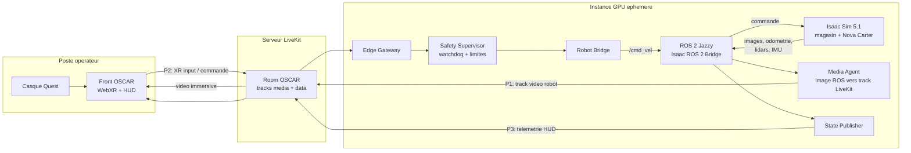
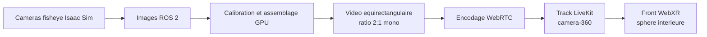
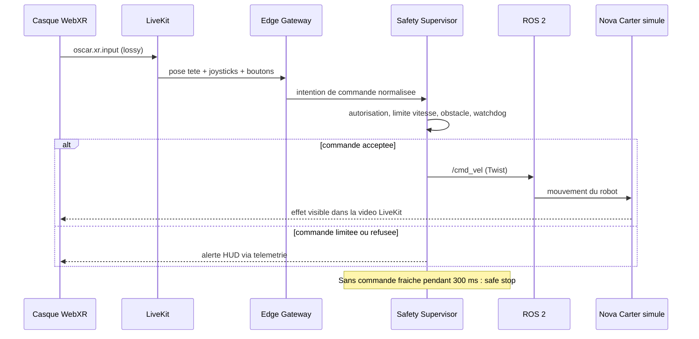
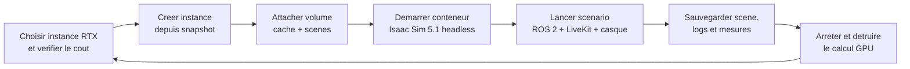

# Validation du systeme OSCAR avec NVIDIA Isaac Sim

Ce document definit le chemin de validation complet du systeme OSCAR sans robot physique :
un supermarche virtuel, un robot simule avec ses capteurs, le serveur LiveKit existant et le
casque VR reel de l'operateur.

L'objectif n'est pas uniquement de voir une video issue de la simulation. Il faut verifier la
boucle complete :

1. Isaac Sim fabrique l'environnement, le robot, son mouvement et ses capteurs.
2. ROS 2 transporte localement les capteurs et les commandes du robot simule.
3. LiveKit transporte a distance l'image, les commandes casque et la telemetrie.
4. Le casque affiche la scene immersive et envoie les intentions de l'operateur.
5. Un garde-fou de securite valide toute commande avant qu'elle atteigne le robot, meme simule.

## Decisions de depart

| Sujet | Choix recommande pour le premier test | Pourquoi |
|:--|:--|:--|
| Version Isaac Sim | `5.1.0` | C'est la derniere release telechargeable indiquee par NVIDIA en mai 2026. La documentation `latest` pointe aussi vers `6.0.0 Early Developer Release`, non disponible sous forme d'artefacts GA. |
| Mode d'installation | Conteneur Linux headless sur instance GPU distante | NVIDIA recommande le conteneur pour les serveurs distants ou le cloud ; il se prete bien aux instances creees puis detruites. |
| Systeme d'exploitation | Ubuntu `24.04` | Isaac Sim 5.1 le supporte et sa passerelle ROS 2 recommande `Jazzy` sur Ubuntu 24.04. |
| ROS | ROS 2 `Jazzy` | Distribution recommandee par NVIDIA avec Ubuntu 24.04 pour la passerelle Isaac Sim. |
| GPU | GPU NVIDIA RTX avec RT Cores et au moins 16 Go de VRAM | Le rendu des capteurs RTX en depend. NVIDIA precise que les GPU sans RT Cores, notamment A100 et H100, ne sont pas supportes par Isaac Sim. |
| Robot v0 | `Nova Carter` | Robot mobile NVIDIA deja concu pour Isaac Sim et ROS 2, avec cameras, IMU et Lidars. Il permet d'avancer avant de modeliser le robot OSCAR final. |
| Monde v0 | `warehouse_multiple_shelves.usd` ou `full_warehouse.usd` | Les environnements officiels contiennent des rayonnages et obstacles ; ils representent suffisamment un magasin pour valider le pilotage. |
| Transport distant | LiveKit existant | Le front casque OSCAR recoit deja la video et envoie deja les entrees XR par LiveKit. |
| Immersion v0 | Camera RGB frontale, puis panorama 360 | Il faut d'abord prouver la boucle video/commande/securite avant d'ajouter le cout du stitching multi-camera. |

Point important pour les credits GPU : une instance de calcul tres puissante n'est pas
forcement une bonne instance Isaac Sim. Une instance A100 ou H100, courante pour l'IA, doit etre
ecartee ici car elle n'a pas les RT Cores requis par Isaac Sim.

## Architecture complete

ROS 2 et LiveKit n'ont pas le meme role :

- **ROS 2** est le bus interne du robot, reel ou simule : mouvement, camera, Lidar, odometrie.
- **LiveKit** est le pont basse latence entre le site robot/simulation et le pilote distant.
- **Le Safety Supervisor** reste entre les commandes distantes et ROS 2. Une simulation est le
  bon endroit pour tester ce garde-fou avant qu'un moteur reel existe.



## Robot initial : Nova Carter

Nova Carter est le meilleur point de depart, non parce qu'il sera necessairement le robot final,
mais parce qu'il donne immediatement un robot mobile pilote par ROS 2 et muni de capteurs.
La documentation NVIDIA liste notamment :

- des cameras stereo RGB Hawk ;
- des cameras fisheye Owl ;
- une IMU ;
- des Lidars 2D et un Lidar 3D ;
- un asset ROS 2 avec graphe d'action deja active.

Pour le premier passage bout en bout, il faut activer la camera avant et commander la base
mobile. Une fois cette boucle validee, les cameras fisheye pourront servir a fabriquer le flux
immersif a 360 degres.

Le robot reel OSCAR pourra ensuite remplacer Nova Carter par import URDF/USD ou par composition
d'un robot personnalise. Le contrat ROS 2 et le contrat LiveKit devront rester stables autant
que possible : c'est ce qui rendra les tests simulation reutilisables sur le materiel.

## Monde supermarche

NVIDIA fournit deja plusieurs mondes d'entrepot USD, dont des scenes avec plusieurs rayonnages
et une scene complete avec obstacles et chariots. Pour OSCAR, l'ordre d'implementation recommande
est le suivant :

| Etape | Monde | But |
|:--|:--|:--|
| Monde A | Entrepot officiel sans modification | Deplacer le robot et recevoir une camera via ROS 2. |
| Monde B | Entrepot avec plusieurs rayons, largeur d'allees ajustee | Tester conduite VR, arrets et confort video. |
| Monde C | Rayons habilles en supermarche, produits et signaletique | Tester la detection produit et les overlays. |
| Monde D | Clients et obstacles dynamiques | Tester Safety, reprise en main et limites de vitesse. |

Il est couteux de construire un beau magasin avant d'avoir valide le flux de commandes. La scene
USD personnalisee devra etre sauvegardee sur un stockage persistant et versionnee avec ses
configurations, afin qu'une nouvelle instance GPU puisse la rouvrir immediatement.

## Camera, video et immersion

### Premiere validation : une camera avant

La v0 utilise une camera RGB du robot et prouve :

- publication de l'image par le pont ROS 2 ;
- transformation en track video LiveKit ;
- reception par le casque ;
- mouvement du robot visible apres une commande joystick ;
- mesure de latence et de stabilite.

Cette etape peut rester en vue plate ou en projection test, car son objectif est de fermer la
boucle fonctionnelle sans confondre les erreurs de transport avec celles de panorama.

### Validation immersive : panorama 360

Isaac Sim supporte des modeles de camera pinhole et fisheye. Nova Carter offre des capteurs
fisheye, mais le front OSCAR ne doit pas recevoir plusieurs images fisheye brutes en esperant
qu'elles deviennent automatiquement une sphere.

Le pipeline 360 cible est donc :



L'etape d'assemblage fisheye vers equirectangulaire est une recommandation d'architecture OSCAR :
elle decoule des capteurs disponibles dans Isaac Sim et du contrat immersif deja defini dans le
front. Elle devra etre implementee dans le futur Media Agent ou dans un noeud de traitement GPU
place avant la publication LiveKit.

Le track panorama transmis au casque devra conserver ce contrat :

```json
{
  "projection": "equirect",
  "layout": "mono",
  "stereo": "none",
  "depth": "none"
}
```

Nom de track recommande : `camera-360`.

### Profondeur

Une video 360 mono ne fournit pas une profondeur fiable. La profondeur sera une extension,
alimentee par une source reelle de simulation : stereo, carte de profondeur rendue par Isaac Sim,
Lidar ou nuage de points. Elle pourra ensuite servir aux overlays 3D, a la distance des obstacles
ou a une reconstruction plus riche, sans bloquer la v1 immersive.

## Contrat ROS 2 de simulation

ROS 2 repose sur un middleware DDS et propose des profils de qualite de service. Pour les
capteurs rapides, le profil `Sensor Data` privilegie les mesures recentes : `best effort` avec
une petite file. Cela correspond aux cameras et Lidars, pour lesquels une vieille image arrivee
en retard est moins utile que la derniere image.

Les noms exacts des topics devront etre releves lors du premier lancement de Nova Carter, mais
le contrat fonctionnel cible est :

| Sens | Donnee | Message ROS 2 cible | QoS recommande | Consommateur |
|:--|:--|:--|:--|:--|
| Isaac vers bridge | Image camera avant | `sensor_msgs/msg/Image` + `CameraInfo` | Sensor Data, best effort | Media Agent |
| Isaac vers bridge | Images fisheye 360 futures | `sensor_msgs/msg/Image` + calibration | Sensor Data, best effort | Stitcher panorama |
| Isaac vers etat | Odometrie / pose robot | `nav_msgs/msg/Odometry`, `/tf` | Sensor Data | State Publisher |
| Isaac vers securite | Lidar / obstacle | `sensor_msgs/msg/LaserScan` ou `PointCloud2` | Sensor Data | Safety Supervisor |
| Isaac vers etat | IMU / articulations | `sensor_msgs/msg/Imu`, `sensor_msgs/msg/JointState` | Sensor Data | State Publisher |
| Bridge vers Isaac | Vitesse de base validee | `geometry_msgs/msg/Twist` sur `/cmd_vel` | Faible latence, surveillee par watchdog | Controleur mobile |

La commande `/cmd_vel` n'est jamais produite directement par le navigateur. Elle vient du Robot
Bridge apres controle d'autorisation, application des limites et verification de fraicheur par
Safety.

## Contrat LiveKit pour le test mixte

LiveKit transporte deux familles de contenu :

- les **tracks media** pour la video et l'audio continus ;
- les **data packets** pour les evenements et valeurs de controle.

LiveKit indique que les packets `lossy` sont adaptes aux mises a jour temps reel, tandis que les
packets `reliable` retransmettent au risque d'arriver plus tard. En mode `lossy`, un payload
court, idealement inferieur a environ 1300 octets, limite la fragmentation reseau.

| Flux OSCAR | Direction | Canal LiveKit | Frequence initiale | Fiabilite | Etat |
|:--|:--|:--|:--|:--|:--|
| Video robot frontale | Sim vers casque | Track video `camera-front` | 30 FPS cible | Media WebRTC | A construire cote simulation |
| Video panorama | Sim vers casque | Track video `camera-360` | 30 FPS cible | Media WebRTC | Etape immersive suivante |
| Pose tete et manettes brutes | Casque vers Gateway | DataPacket `oscar.xr.input`, JSON | 30 Hz actuel | `lossy` | Deja publie par le front |
| Commande robot interpretee | Gateway vers Safety | Interne instance | 30 a 60 Hz | locale | A construire |
| Telemetrie robot / securite | State vers casque | DataPacket `oscar.robot.telemetry`, JSON | 10 Hz + evenement | `reliable` | A construire |
| Pose robot rapide, si necessaire | State vers casque | DataPacket `oscar.robot.pose`, binaire | 60 Hz cible | `lossy` | Futur |
| Detection produit / overlays | IA vers casque | DataPacket `oscar.ai.overlays`, JSON horodate | environ 5 Hz | `reliable` | Futur |

Le prototype actuel envoie les valeurs WebXR brutes a 30 Hz. La cible operationnelle ne consiste
pas a brancher ces valeurs directement sur les roues : le Gateway les transforme en intentions
de mouvement, Safety les borne et le Bridge emet les messages ROS 2.

## Teleoperation et securite



Tests de securite indispensables en simulation :

- perte de connexion casque : arret du robot en moins de 300 ms selon le watchdog prevu ;
- joystick maximum : vitesse limitee a la valeur autorisee ;
- obstacle devant le robot : refus du mouvement avant ;
- bascule manuel/autonome : l'operateur conserve une reprise en main prioritaire ;
- arret d'urgence : ordre traite comme evenement prioritaire et visible dans le HUD.

## HUD et detections futures

La simulation permettra de resoudre proprement le sujet le plus delicat du rendu VR : la position
des informations dans le champ visuel.

Deux familles d'elements ne doivent pas etre melangees :

| Famille | Exemple | Placement VR |
|:--|:--|:--|
| Cockpit operateur | connexion, vitesse, mode, Safety, batterie, latence | Fixe dans le champ visuel, lisible sans chercher. |
| Annotation du monde | nom et prix d'un produit detecte sur une etagere | Attachee a la direction de l'objet dans la video/panorama et masquee si hors champ. |

Pour une detection produit dans un panorama, l'IA devra renvoyer au minimum l'identifiant de la
frame, la taille de l'image source, la projection (`equirect`) et la boite normalisee du produit.
Le front pourra alors convertir sa position en direction sur la sphere immersive, puis effectuer
la selection par regard ou pointeur de manette. Avant d'atteindre cette etape, la simulation doit
d'abord livrer une image stable et des mouvements commandes de facon sure.

## Iteration rapide avec instances GPU ephemeres

Le principe est de payer la puissance GPU seulement pendant les essais, sans perdre les elements
longs a reconstruire entre deux sessions.

### Ce qui doit persister

| Element conserve entre deux instances | Emplacement recommande |
|:--|:--|
| Code front, bridge, scripts ROS et configuration scenario | Depot Git |
| Scene USD du supermarche et assets personnalises | Depot si leger ; stockage objet ou disque persistant si lourd |
| Cache Isaac Sim / shaders / assets telecharges | Volume persistant ou snapshot de disque |
| Image conteneur ou recette d'installation verrouillee | Tag Isaac Sim `5.1.0` + script bootstrap versionne |
| Mesures de latence, rosbag, captures de test | Stockage persistant horodate |
| Secrets LiveKit | Gestionnaire de secrets ou variables d'instance, jamais dans Git |

### Cycle de travail



Mesures de controle de cout :

- ne provisionner qu'une reference GPU deja validee comme compatible RTX ;
- conserver un snapshot apres la premiere installation et le chauffage des shaders, car NVIDIA
  indique que les lancements suivants sont plus rapides avec le cache monte ;
- activer une alerte budget chez le fournisseur ;
- mettre un arret automatique apres une periode d'inactivite ;
- noter pour chaque session l'heure de creation, d'arret, le type GPU et le cout horaire.

## Configuration de la premiere machine GPU

Des que les informations d'acces a une instance sont disponibles, le premier passage suivra cette
checklist :

1. Verifier le modele GPU, la VRAM, le pilote NVIDIA et la presence de RT Cores.
2. Verifier l'OS Ubuntu et retenir Ubuntu 24.04 si le fournisseur permet le choix.
3. Installer Docker et NVIDIA Container Toolkit, puis verifier que le GPU est visible depuis un conteneur.
4. Recuperer le conteneur `nvcr.io/nvidia/isaac-sim:5.1.0` et executer le controle de compatibilite Isaac Sim.
5. Monter des repertoires persistants pour les caches, configurations, donnees et logs Isaac Sim.
6. Installer ou activer ROS 2 Jazzy et la passerelle ROS 2 Isaac Sim.
7. Lancer Isaac Sim en mode headless avec le monde d'entrepot et Nova Carter.
8. Verifier les topics camera, odometrie, Lidar et la reception d'une commande de mouvement.
9. Lancer le Media Agent et publier une camera de simulation vers la room LiveKit.
10. Connecter le casque, tester la video, les entrees XR, Safety et l'arret de liaison.
11. Sauvegarder le cache et les resultats, puis detruire l'instance GPU.

Nous n'ouvrirons pas les ports au hasard : l'instance doit pouvoir joindre LiveKit en sortie et
ne doit exposer que ce qui est necessaire au diagnostic ou au streaming distant choisi.

## Jalons de validation

| Jalon | Reussite attendue | Cout GPU a limiter |
|:--|:--|:--|
| J0 - Compatibilite | Isaac Sim demarre headless et le test NVIDIA passe. | Une courte session d'installation/snapshot. |
| J1 - Simulation ROS | Nova Carter bouge dans l'entrepot et sa camera est publiee sur ROS 2. | Une session de mise au point. |
| J2 - Video LiveKit | Le casque recoit la camera simulee via le serveur actuel. | Une session de connectivite. |
| J3 - Commande VR | Un joystick Quest fait avancer/tourner le robot simule via Gateway, Safety et `/cmd_vel`. | Plusieurs tests courts. |
| J4 - HUD | Telemetrie et notifications Safety apparaissent dans le HUD VR organise. | Test fonctionnel court. |
| J5 - Immersion 360 | Panorama equirectangulaire `camera-360` visible a l'interieur de la sphere VR. | Session GPU plus lourde pour stitching. |
| J6 - Produits IA | Detections produits positionnees correctement dans le monde immersif. | Apres stabilisation de J0 a J5. |

## Informations a fournir pour lancer la configuration

Pour configurer effectivement la premiere instance sans gaspillage, il faudra fournir :

| Information | Usage |
|:--|:--|
| Fournisseur cloud et region | Identifier les instances RTX disponibles et leur tarification. |
| Type GPU exact envisage | Eviter A100/H100 et verifier VRAM/RT Cores avant location. |
| Adresse et methode d'acces SSH | Installer et piloter la machine a distance. |
| Version Ubuntu disponible | Choisir le couple Isaac Sim / ROS 2 adapte. |
| Droits administrateur | Installer pilotes/outils si absents. |
| Disque persistant ou mecanisme de snapshot | Eviter de repayer l'installation et le cache. |
| Regles reseau sortantes | Valider l'acces aux assets NVIDIA et au serveur LiveKit. |
| Plafond de duree ou de budget par session | Integrer un arret automatique adapte. |

## Sources techniques officielles

- NVIDIA, [Isaac Sim Download / Latest Release](https://docs.isaacsim.omniverse.nvidia.com/6.0.0/installation/download.html) : la release telechargeable listee est `5.1.0` ; `6.0.0` est presentee comme Early Developer Release.
- NVIDIA, [Isaac Sim 5.1 Requirements](https://docs.isaacsim.omniverse.nvidia.com/5.1.0/installation/requirements.html) : OS, VRAM, pilotes, contrainte RT Cores et exclusion A100/H100.
- NVIDIA, [Isaac Sim 5.1 Container Installation](https://docs.isaacsim.omniverse.nvidia.com/5.1.0/installation/install_container.html) : deploiement headless distant, conteneur `5.1.0`, volumes de cache et test de compatibilite.
- NVIDIA, [Isaac Sim 5.1 ROS 2 Installation](https://docs.isaacsim.omniverse.nvidia.com/5.1.0/installation/install_ros.html) : bridge ROS 2 et recommandation Jazzy sur Ubuntu 24.04.
- NVIDIA, [Environment Assets](https://docs.isaacsim.omniverse.nvidia.com/5.1.0/assets/usd_assets_environments.html) : environnements Warehouse officiels.
- NVIDIA, [Nova Carter](https://docs.isaacsim.omniverse.nvidia.com/latest/assets/nova_carter_landing_page.html) : capteurs du robot et asset ROS 2. Cette page appartient actuellement a la documentation 6.0 EDR ; les capacites devront etre confirmees dans les assets `5.1.0` charges.
- NVIDIA, [Camera Sensors](https://docs.isaacsim.omniverse.nvidia.com/5.1.0/sensors/isaacsim_sensors_camera.html) : modeles de calibration pinhole et fisheye.
- ROS 2 Jazzy, [Quality of Service settings](https://docs.ros.org/en/jazzy/Concepts/Intermediate/About-Quality-of-Service-Settings.html) : DDS, reliable/best effort et profil sensor data.
- ROS 2 Jazzy, [geometry_msgs/Twist](https://docs.ros.org/en/jazzy/p/geometry_msgs/msg/Twist.html) et [sensor_msgs/Image](https://docs.ros.org/en/jazzy/p/sensor_msgs/msg/Image.html) : types de messages commande et camera.
- LiveKit, [Data packets](https://docs.livekit.io/transport/data/packets/) : packets reliable/lossy, topics et limites de taille.
- LiveKit, [Data tracks](https://docs.livekit.io/transport/data/data-tracks/) : transport faible latence adapte a la robotique et a la teleoperation.
